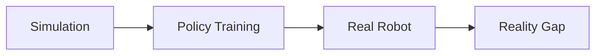

layout: cover
class: title-card
---

<div class="uts-mark">
  <div>UTS</div>
  <div class="uts-symbol">AI</div>
</div>

<div class="title-copy">
  <h1>Robotics Institute</h1>
  <h2>41118 AI in Robotics</h2>
  <h3>Introduction to End-to-End Robotics</h3>
  <p>Learning robot behavior directly from data</p>
</div>

---
layout: center
class: text-center
---

# Big Question

<div class="question-visual">
  <div class="big-quote">
  Can a robot learn the whole path from <span>sensing</span> to <span>acting</span>?
  </div>
  
</div>

---
layout: two-cols
---

# What is Robotics?

Robotics combines sensing, reasoning, motion, and control to make machines interact with the physical world.

<div class="grid-4 compact mt-8">
  <div class="tile">👁️<br/><b>Sense</b><br/>cameras, depth, touch</div>
  <div class="tile">🧠<br/><b>Decide</b><br/>planning and policies</div>
  <div class="tile">🦾<br/><b>Act</b><br/>motors and grippers</div>
  <div class="tile">🌍<br/><b>Adapt</b><br/>messy real world</div>
</div>

::right::

<figure class="online-figure">
  
  <figcaption>Modern cobot hardware: sensors, joints, controller, and gripper.</figcaption>
</figure>

---
layout: default
---

# Traditional Robotics Pipeline

<div class="pipeline-visual modules">
  <div><span>Camera</span><b>Sensors</b></div>
  <div><span>Detect</span><b>Perception</b></div>
  <div><span>Track</span><b>State</b></div>
  <div><span>Search</span><b>Planning</b></div>
  <div><span>Servo</span><b>Control</b></div>
  <div><span>Move</span><b>Action</b></div>
</div>

<div class="note mt-8">
Traditional systems break the problem into modules. Each module is designed, tuned, and tested separately.
</div>

---
layout: default
---

# End-to-End Robotics Pipeline

<div class="e2e-visual">
  <div class="sensor-card">
    
    <span>observation</span>
  </div>
  <div class="network-card">
    <span></span><span></span><span></span>
    <b>learned policy</b>
  </div>
  <div class="action-card">
    <b>Δx, Δθ, gripper</b>
    <span>next action sequence</span>
  </div>
</div>

<div class="big-formula mt-8">observation + goal → neural network → action</div>

---
layout: two-cols
---

# Bimanual Manipulators

What the policy observes:

- Multi-camera views of both arms and the workspace
- Joint angles for the left and right manipulators
- Gripper state and contact-rich object motion
- Task goal, demonstration history, or language cue
- Relative pose between both end-effectors

::right::

<div class="video-card">
  <iframe
    src="https://www.youtube.com/embed/ZpHapIlJnMo?autoplay=1&mute=1&loop=1&playlist=ZpHapIlJnMo"
    title="Bimanual manipulator robotics example video"
    allow="accelerometer; autoplay; clipboard-write; encrypted-media; gyroscope; picture-in-picture; web-share"
    allowfullscreen
  ></iframe>
</div>

<div class="caption mt-3">
End-to-end bimanual control learns to coordinate two arms as one policy for handoff, folding, assembly, and tool use.
</div>

Outputs can include synchronized reaches, two-handed grasps, force-aware repositioning, and smooth handover motions.

---
layout: two-cols
---

# Humanoid End-to-End Example

What the policy observes:

- Head and wrist camera video
- Joint angles and body pose
- Foot contact and balance signals
- Language instruction or task goal
- Recent actions and motion history

::right::

<div class="video-card">
  <iframe
    src="https://www.youtube.com/embed/HYwekersccY"
    title="Humanoid robotics example video"
    allow="accelerometer; autoplay; clipboard-write; encrypted-media; gyroscope; picture-in-picture; web-share"
    allowfullscreen
  ></iframe>
</div>

<div class="caption mt-3">
Humanoid end-to-end robotics maps perception, balance, and task context directly into whole-body actions.
</div>

Outputs can include walking, reaching, grasping, gaze, and recovery motions as one coordinated policy.

---
layout: default
---

# Example Task: Pick Up a Cup

<div class="cup-task-visual" aria-label="Robot arm observing and reaching for a cup">
  <div class="robot-arm">
    <span class="joint shoulder"></span>
    <span class="link upper"></span>
    <span class="joint elbow"></span>
    <span class="link forearm"></span>
    <span class="gripper"></span>
  </div>
  <div class="tabletop">
    <span class="cup"></span>
    <span class="block red"></span>
    <span class="block blue"></span>
  </div>
  <div class="vision-box">
    <span>camera view</span>
  </div>
  <div class="action-path"></div>
</div>

<div class="sequence">
  <div>📷<br/><b>Observe</b><br/>camera sees cup</div>
  <div>🧠<br/><b>Predict</b><br/>policy chooses action</div>
  <div>🦾<br/><b>Move</b><br/>arm reaches and grasps</div>
  <div>✅<br/><b>Check</b><br/>success or retry</div>
</div>

---
layout: default
---

# Main Learning Approaches

<div class="grid-3 visual-cards mt-8">
  <div class="card"><div class="card-icon demo"></div><b>Imitation Learning</b><br/>Learn from expert demonstrations.</div>
  <div class="card"><div class="card-icon reward"></div><b>Reinforcement Learning</b><br/>Learn by trial, reward, and feedback.</div>
  <div class="card"><div class="card-icon dataset"></div><b>Offline Robot Learning</b><br/>Learn from existing datasets without new trials.</div>
</div>

---
layout: two-cols
---

# Imitation Learning

The robot copies behavior from demonstrations.


The idea is very intuitive: show the robot what to do, then train it to repeat similar behavior.

::right::

<div class="demo-loop">
  <div>Human demo</div>
  <div>Dataset</div>
  <div>Train Policy</div>
  <div>Robot Deploy</div>
</div>


---
layout: two-cols
---

# Human Demonstration

- A human teleoperates or physically guides the robot
- Cameras and joint sensors record every step
- Successful trials become training demonstrations
- The learned policy later imitates the same behavior on its own

::right::

<div class="video-card">
  <video autoplay muted loop playsinline controls>
    <source src="https://packaged-media.redd.it/5nijvjz0nzsg1/pb/m2-res_590p.mp4?m=DASHPlaylist.mpd&c=wh_ben_en&var=sgpssan&v=1&e=1777658400&s=90c814c98b8b9ce47ad03005b9eb1cc496dd7baa" type="video/mp4" />
  </video>
</div>

<div class="caption mt-3">
The key idea is simple: the robot first watches or feels an expert solve the task, then learns to reproduce that sequence.
</div>

---
layout: two-cols
---

# Dataset


- Each episode records camera views over time
- Robot states and actions are saved at each step
- Different trials capture variation in objects and motion
- The dataset becomes the training signal for the policy
- Hunderds if not thousands of human demonstration are required for a robot to perform the action successfully


::right::

<div class="video-card">
  <video autoplay muted loop playsinline controls>
    <source src="https://packaged-media.redd.it/a08moyrqeixg1/pb/m2-res_1080p.mp4?m=DASHPlaylist.mpd&var=sgpssan&v=1&e=1777658400&s=6c6f54261454c48b002b9bd66628ecd195975acb" type="video/mp4" />
  </video>
</div>

<div class="caption mt-3">
A dataset browser lets us inspect many recorded episodes, compare camera views, and see how trajectories vary across demonstrations.
</div>

---
layout: two-cols
---

# Training

- Episodes are loaded in batches from the dataset
- Neural Network is trained to predict the actions given observation
- Goal is to reduce the loss function while performing well on validation datasets

::right::

<figure class="online-figure">
  
</figure>

<div class="caption mt-3">
During training, we watch metrics like loss and validation performance to see whether the policy is actually learning useful behavior.
</div>

---
layout: two-cols
---

# Policy Deployment


- Live camera images and robot state are streamed into the policy
- The policy predicts the next action at every control step
- Those actions are sent to the robot controller in real time
- The robot keeps observing, acting, and updating in a closed loop

::right::

<div class="video-card">
  <video autoplay muted loop playsinline controls>
    <source src="https://website.pi-asset.com/pi07/zeroshot_air_fryer_attempt_compressed.mp4" type="video/mp4" />
  </video>
</div>

<div class="caption mt-3">
Deployment means taking the trained model out of the notebook and letting it drive the physical robot from live observations.
</div>

---
layout: default
---

# Model Zoo: Different Imitation Learning Policies

<div class="grid-4 compact mt-8">
  <div class="card"><b>Diffusion Policy</b><br/>Starts with noisy actions, then denoises into a smooth plan.</div>
  <div class="card"><b>ACT</b><br/>Predicts chunks of future actions with a transformer.</div>
  <div class="card"><b>VLA</b><br/>Vision + language + robot data → action tokens.</div>
  <div class="card"><b>Generalist Policies</b><br/>Pretrained on many robots, then adapted to a new robot.</div>
</div>

<div class="note mt-8">
All of these are Imitation Learning, but they differ in the action representation: text-like tokens, denoised trajectories, action chunks, or pretrained multi-robot policies.
</div>

<div class="project-strip mt-6">
  <figure><figcaption>Diffusion Policy</figcaption></figure>
  <figure><figcaption>ACT</figcaption></figure>
  <figure><figcaption>VLA</figcaption></figure>
  <figure><figcaption>Generalist</figcaption></figure>
</div>


---
layout: default
---

# Diffusion Policy

<div class="diffusion-policy-overview">
  <div>
    Core idea: instead of predicting one action directly, the policy generates a short action sequence by denoising it step by step.

    - Input: camera observations and robot state
    - Output: a smooth future trajectory
    - Best at: continuous manipulation where many action paths could work
  </div>

  <figure class="project-figure diffusion-policy-figure">
    
    <figcaption>Project overview: observations condition a denoising policy over actions.</figcaption>
  </figure>
</div>

---
layout: two-cols
---

# Before Robotics: Diffusion

Diffusion models were first popularized in generative media tasks.

- In image generation, a model starts from noise and gradually denoises toward a valid image.
- Diffusion Policy borrows the same idea, but denoises an action sequence instead of pixels.
- That makes it natural for multimodal behavior: several different futures can all be valid.

::right::

<div class="origin-grid">
  <div>
    
    <span>Image generation: noise → denoise → final image</span>
  </div>
  <div>
    <div class="video-card">
      <video autoplay muted loop playsinline controls>
        <source src="https://diffusion-policy.cs.columbia.edu/videos/highlight_pusht_process.mp4" type="video/mp4" />
      </video>
    </div>
    <span>Robot control: noise → denoise → final trajectory</span>
  </div>
</div>

---
layout: two-cols
---

# Why Diffusion Helps Manipulation

Many robot tasks are multimodal.

Example: to push an object, the robot may approach from the left or right. Both can be correct.

Diffusion policies can represent several possible futures before settling on one consistent action sequence.

::right::

<figure class="project-figure">
  
  <figcaption>Project figure: diffusion can model multiple valid action modes.</figcaption>
</figure>

---
layout: two-cols
---

# Example: Diffusion Policy

**How it works**

```text
observation history
→ sample noisy action sequence
→ repeatedly denoise actions
→ execute first few actions
→ replan
```

- Good at multimodal behavior: there may be several valid ways to solve a task.
- Predicts action sequences for receding-horizon control.
- Best fit: precise continuous manipulation.

::right::

<div class="video-card">
  <video autoplay muted loop playsinline controls>
    <source src="https://diffusion-policy.cs.columbia.edu/videos/pusht_ep6_diffusion.mp4" type="video/mp4" />
  </video>
</div>

<div class="caption">Diffusion Policy project video: denoise a Push-T action sequence.</div>

---
layout: two-cols
---

# ACT

ACT stands for Action Chunking Transformer.

- It predicts a chunk of future actions, not just the next control step.
- It is trained from demonstrations, often teleoperated ones.
- It works especially well for long, precise manipulation sequences.

::right::

<figure class="project-figure">
  
  <figcaption>ACT predicts short windows of future actions from multi-camera robot observations.</figcaption>
</figure>

---
layout: two-cols
---

# Before Robotics: Transformers

Before ACT, transformers were already strong at sequence modeling.

- In language, transformers predict the next tokens in a sentence.
- In ACT, the sequence is not words but robot actions over time.
- The chunking idea helps the robot plan a short motion phrase instead of one tiny twitch.

::right::

<div class="origin-grid">
  <div><b>Language</b><span>token sequence over time</span></div>
  <div><b>Robot control</b><span>action sequence over time</span></div>
</div>

---
layout: two-cols
---

# Example: ACT

**How it works**

```text
camera views + joint state
→ transformer policy
→ chunk of future actions
→ temporal aggregation
→ smoother control
```

- Learns from teleoperated demonstrations.
- Chunking shortens the effective decision horizon.
- Best fit: low-cost arms and bimanual manipulation.

::right::

<figure class="online-figure small mb-4">
  
</figure>

<a class="video-popup-card" href="https://tonyzhaozh.github.io/aloha/resources/open_lid.mp4" onclick="window.open(this.href, 'actVideo', 'width=1040,height=640,noopener,noreferrer'); return false;">
  
  <span>Open project video</span>
</a>

<div class="caption">ALOHA / ACT project video: bimanual task execution.</div>

---
layout: two-cols
---

# ACT: Why Predict Action Chunks?

Instead of predicting one tiny action at a time, ACT predicts a short future window.

```text
observation now → [a₁, a₂, a₃, ... aₖ]
```

This helps long-horizon tasks because the policy commits to a small motion plan, not just the next twitch.

::right::

<figure class="project-figure">
  
  <figcaption>ALOHA / ACT paper figure: images and joints feed a transformer that predicts action chunks.</figcaption>
</figure>

---
layout: two-cols
---

# ACT: Temporal Aggregation

ACT often predicts overlapping action chunks at every timestep.

Multiple predictions vote on what the robot should do now.

<div class="note mt-6">
Temporal aggregation smooths control and reduces jitter from individual predictions.
</div>

::right::

<figure class="project-figure">
  
  <figcaption>The ACT diagram shows action chunks; overlapping chunks can be aggregated over time.</figcaption>
</figure>

---
layout: two-cols
---

# ACT: Why It Worked for ALOHA

ACT pairs well with teleoperation datasets:

- Human demos provide complete behavior.
- Transformers handle multi-camera observations.
- Action chunks make contact-rich bimanual tasks smoother.
- A compact policy can run on relatively low-cost hardware.

::right::

<a class="video-popup-card" href="https://tonyzhaozh.github.io/aloha/resources/teleop_all.mp4" onclick="window.open(this.href, 'alohaTeleopVideo', 'width=1040,height=640,noopener,noreferrer'); return false;">
  
  <span>Open teleoperation video</span>
</a>

---
layout: two-cols
---

# VLA Models

Vision-Language-Action models combine perception, language understanding, and action prediction in one network.

Modern end-to-end systems can combine:

<div class="big-formula mt-8">
image + instruction + robot state → action
</div>

Example instruction:

> “Pick up the red block and place it in the bowl.”

::right::

<figure class="online-figure">
  
  <figcaption>RT-2: VLMs adapted to output robot actions.</figcaption>
</figure>

---
layout: two-cols
---

# Before Robotics: VLMs and LLMs

VLAs come from the same family as vision-language and language models.

- VLMs learned to connect images and text.
- LLM-style transformers learned large-scale sequence prediction.
- VLAs reuse that machinery, but ask the model to output robot actions.

::right::

<div class="origin-grid">
  <div><b>Vision-language models</b><span>image + text → text</span></div>
  <div><b>VLA models</b><span>image + text + state → action</span></div>
</div>

---
layout: two-cols
---

# Example: VLA Models

**How they work**

```text
camera image
+ language instruction
+ robot state
→ vision-language-action model
→ robot action tokens
```

- RT-2 adapts vision-language models so action can be represented like tokens.
- OpenVLA is an open 7B VLA trained on large robot datasets.
- Best fit: broad language-conditioned manipulation.

::right::

<figure class="online-figure small mb-4">
  
</figure>

<a class="video-popup-card" href="https://openvla.github.io/static/videos/openvla_teaser_video.mp4" onclick="window.open(this.href, 'openvlaVideo', 'width=1040,height=640,noopener,noreferrer'); return false;">
  
  <span>Open project video</span>
</a>

<div class="caption">OpenVLA project video: image + instruction → action.</div>

---
layout: two-cols
---

# VLA Internals: What Gets Tokenized?

VLA models turn a robot problem into a sequence prediction problem.

<div class="token-flow">
  <div><b>Image patches</b><span>visual tokens</span></div>
  <div><b>Instruction</b><span>language tokens</span></div>
  <div><b>Robot state</b><span>joint / gripper tokens</span></div>
  <div><b>Action</b><span>discrete or continuous action tokens</span></div>
</div>

Key idea: the model can use language reasoning and visual features before choosing robot actions.

::right::

<figure class="project-figure">
  
  <figcaption>OpenVLA project figure: image and instruction tokens are decoded into robot actions.</figcaption>
</figure>

---
layout: two-cols
---

# VLA Strengths and Failure Modes

**Strengths**

- Can follow new language instructions.
- Can reuse internet-scale visual knowledge.
- Can generalize across objects and tasks better than narrow policies.

**Failure modes**

- Spatial precision can be hard.
- Rare robot states may be underrepresented.
- Language can sound confident even when control is uncertain.

::right::

<div class="project-grid">
  <figure><figcaption>Visual matching</figcaption></figure>
  <figure><figcaption>Control gap</figcaption></figure>
</div>

---
layout: two-cols
---

# Generalist Policies / Octo

Generalist robot policies aim to train once on many tasks, robots, and datasets, then adapt to a new setup.

- Instead of learning one narrow skill, they learn broad robot experience.
- Octo is a strong example of this style.
- The hope is similar to foundation models: pretrain broadly, then specialize quickly.

::right::

<figure class="project-figure">
  
  <figcaption>Octo is designed as a generalist policy trained across many robot datasets.</figcaption>
</figure>

---
layout: two-cols
---

# Before Robotics: Foundation Models

The generalist-policy idea mirrors what happened in language and vision foundation models.

- Pretrain on a huge, diverse dataset
- Learn broad reusable representations
- Fine-tune or adapt for a specific downstream task

In robotics, the challenge is harder because datasets come from different robots, sensors, and action spaces.

::right::

<div class="origin-grid">
  <div><b>Foundation models</b><span>pretrain broadly, adapt later</span></div>
  <div><b>Generalist robotics</b><span>multi-robot pretraining, task-specific adaptation</span></div>
</div>

---
layout: two-cols
---

# Example: Octo

**How it works**

```text
large multi-robot dataset
→ pretrained generalist policy
→ language or goal image
→ diffusion-decoded actions
→ optional fine-tuning
```

- Pretrained on many robot episodes from Open X-Embodiment.
- Supports flexible cameras, robot states, and action spaces.
- Best fit: start from a capable policy, then adapt.

::right::

<figure class="online-figure small mb-4">
  
</figure>

<div class="project-link-card">
  
  <a href="https://octo-models.github.io/" onclick="window.open(this.href, 'octoProject', 'width=1040,height=720,noopener,noreferrer'); return false;">Open Octo project page</a>
</div>

<div class="caption">Octo project page: generalist policy results across robot setups.</div>

---
layout: default
---

# Comparing the Models

<table class="model-table">
  <thead>
    <tr>
      <th>Model family</th>
      <th>Input</th>
      <th>Action style</th>
      <th>Why use it?</th>
    </tr>
  </thead>
  <tbody>
    <tr>
      <td>Diffusion Policy</td>
      <td>Images + state history</td>
      <td>Denoised action sequence</td>
      <td>Smooth continuous control</td>
    </tr>
    <tr>
      <td>ACT</td>
      <td>Multi-camera images + joints</td>
      <td>Action chunks</td>
      <td>Data-efficient imitation</td>
    </tr>
    <tr>
      <td>VLA / RT-2 / OpenVLA</td>
      <td>Image + language + state</td>
      <td>Action tokens</td>
      <td>Language reasoning and generalization</td>
    </tr>
    <tr>
      <td>Octo</td>
      <td>Language or goal image + observations</td>
      <td>Diffusion-decoded actions</td>
      <td>Pretrain once, fine-tune broadly</td>
    </tr>
  </tbody>
</table>

---
layout: default
---

# Why End-to-End Robotics is Exciting

<div class="benefit-wheel">
  <div>Less manual engineering</div>
  <div>Learns from data</div>
  <div>Uses foundation models</div>
  <div>Handles visual complexity</div>
  <div>Generalizes across tasks</div>
</div>

---
layout: default
---

# Why It Is Hard

<div class="grid-2 mt-8">
  <div class="card"><b>Data</b><br/>Robots need many high-quality examples.</div>
  <div class="card"><b>Safety</b><br/>Wrong actions can damage objects or hurt people.</div>
  <div class="card"><b>Generalization</b><br/>New lighting, objects, or rooms can break policies.</div>
  <div class="card"><b>Evaluation</b><br/>Success is physical, not just digital.</div>
</div>

<div class="risk-meter mt-7">
  <span>data scarcity</span>
  <span>safety risk</span>
  <span>distribution shift</span>
  <span>physical testing</span>
</div>

---
layout: two-cols
---

# Sim-to-Real Transfer

Robots often train in simulation before running in the real world.



The challenge: simulated physics and real physics are never exactly the same.

::right::

<figure class="project-figure">
  
  <figcaption>OpenVLA project figure: control mismatch is one practical sim-to-real problem.</figcaption>
</figure>

---
layout: default
---

# Videos and References

<div class="refs-grid">
  <div>
    <b>Project Media</b>
    <a href="https://openvla.github.io/static/videos/openvla_teaser_video.mp4" onclick="window.open(this.href, 'openvlaVideo', 'width=1040,height=640,noopener,noreferrer'); return false;">OpenVLA project video</a>
    <a href="https://diffusion-policy.cs.columbia.edu/videos/pusht_ep6_diffusion.mp4" onclick="window.open(this.href, 'diffusionPolicyVideo', 'width=1040,height=640,noopener,noreferrer'); return false;">Diffusion Policy Push-T video</a>
    <a href="https://tonyzhaozh.github.io/aloha/resources/open_lid.mp4" onclick="window.open(this.href, 'actVideo', 'width=1040,height=640,noopener,noreferrer'); return false;">ALOHA / ACT task video</a>
    <a href="https://octo-models.github.io/" onclick="window.open(this.href, 'octoProject', 'width=1040,height=720,noopener,noreferrer'); return false;">Octo project results</a>
  </div>
  <div>
    <b>Project Pages</b>
    <a href="https://deepmind.google/blog/rt-2-new-model-translates-vision-and-language-into-action/">RT-2</a>
    <a href="https://openvla.github.io/">OpenVLA</a>
    <a href="https://diffusion-policy.cs.columbia.edu/">Diffusion Policy</a>
    <a href="https://tonyzhaozh.github.io/aloha/">ALOHA / ACT</a>
    <a href="https://octo-models.github.io/">Octo</a>
  </div>
  <div>
    <b>Docs and Images</b>
    <a href="https://huggingface.co/docs/lerobot/en/act">LeRobot ACT docs</a>
    <a href="https://commons.wikimedia.org/wiki/File:UR16e_robot_arm.png">Wikimedia cobot image</a>
    <a href="https://deepmind.google/blog/rt-2-new-model-translates-vision-and-language-into-action/">RT-2 images and explainer</a>
  </div>
</div>

---
layout: two-cols
---

# How Do We Evaluate a Robot?

- Task success rate
- Safety and collision rate
- Generalization to new objects
- Generalization to new environments
- Data efficiency
- Human interpretability

::right::

<div class="eval-board">
  <div><b>92%</b><span>success</span></div>
  <div><b>0</b><span>collisions</span></div>
  <div><b>5</b><span>new objects</span></div>
  <div><b>10</b><span>demos</span></div>
</div>

---
layout: center
class: text-center
---

# Key Takeaway

<div class="big-quote">
End-to-end robotics learns a direct path from perception to action, but real-world safety and generalization remain major challenges.
</div>

---
layout: center
class: text-center
---

# Discussion

Would you trust an end-to-end robot in a home, hospital, or factory?

<div class="mt-14 opacity-70">What would it need to prove first?</div>

---
layout: two-cols
---

# Reinforcement Learning

The robot learns by trying actions and receiving rewards.

```text
try action → observe result → receive reward → improve policy
```

Powerful, but real robots make exploration expensive, slow, and sometimes unsafe.

::right::

<div class="reward-loop">
  <div class="world"></div>
  <div class="loop-arrow">try → reward → improve</div>
</div>
